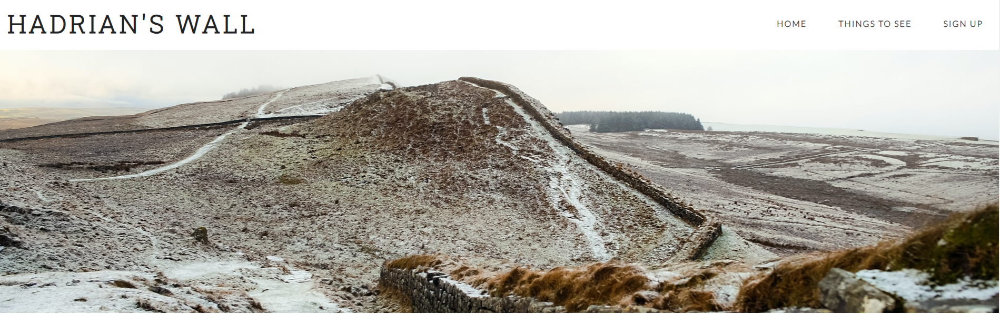
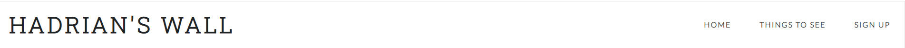
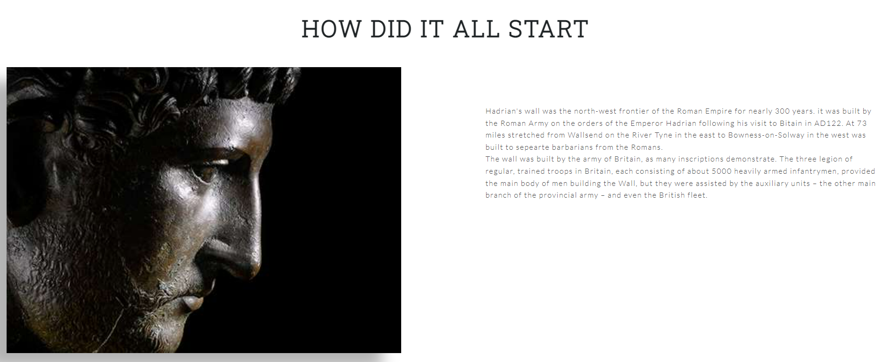
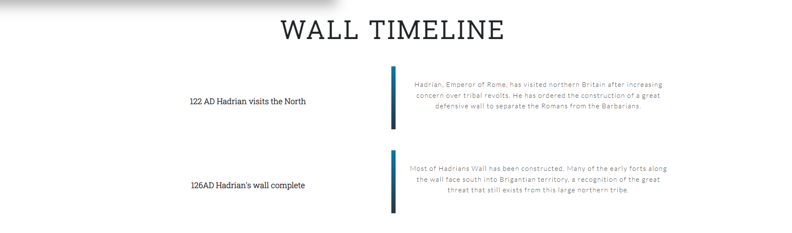
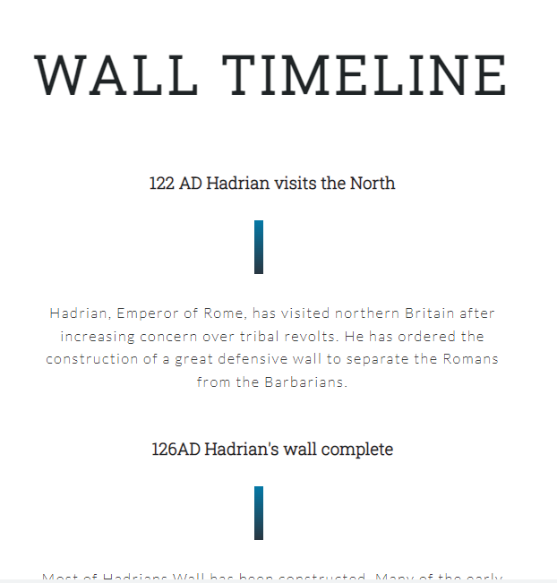
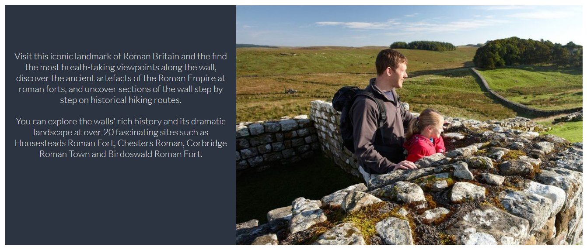
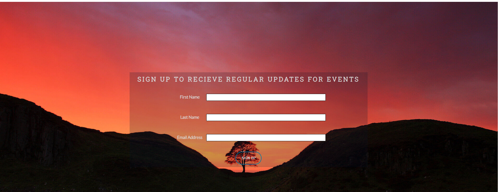

# Hadrian's Wall

The aim of the website is to provide the users with one of the most iconic landmark based in the North East of England. The website attempt to explore why the wall was built and the events leading in to building this wall. The website will be of interest to anyone who is planning to visit Hadrian's wall in order to get knowledge regarding this landmark beforehand.

## Features 

The website is divided into three different page.
* HomePage - Documents an Introduction section and Timeline of events.
* Things to see - Gives basic information rearding the different sites of the Hadrian's wall.
* Contact Us - This is where user has a oppurtunity to contact a specialist if they have any question regarding the vist.

### Existing Features

- __Navigation Bar__

  - Featured on all three pages, the full responsive navigation bar includes links to the Logo, Home page, Things to See and Sign Up page and is identical in each page to allow easy navigation.
  - Clicking on the logo will tae the user back to the home page.
  - This section will allow the user to easily navigate from page to page across all devices without having to revert back to the previous page via the ‘back’ button.
  - For guidance and interactive reasons the navigation links have got a animation line beneath it that tells the users what section they have selected.  

- __The landing page image__

  - The landing page includes a photograph showing the a section of the wall. 
  - The image was chosen with careful consideration to the color theme I want to implement on the page.

- __How Did it All Start Section__

  - This section will provide the users with a brief background of the wall 'How it All Started" and when and why was it built. 
  - This particlar section has been divided into two areas.
    * The introduction/ background area for the wall. 
    * And the emperor Hadrians' image that fades in when the landing page is loaded.

- __Timeline Section__

  - This section focuses on the events that took place leading up to the wall being built and after the wall was built. 
  - The section gives a very brief summary in a timeline fashion to the users regarding the events that took place and at what dates.
  - This section again has been animated in order to capture the user's attention.  
  - I had to restructure this section and aligned the items vertically instead of horizantally once the screen size drops below 700px, so as to keep the structure of the page intact. Please see the screen shot below. 

- __The Footer__ 

  - The footer section includes links to the relevant social media sites. The links will open to a new tab to allow easy navigation for the user. 
  - The footer is valuable to the user as it encourages them to keep connected via social media and keep up to date with the upcomng events.

- __Things to See__

  - This page will provide the user with a information regarding the historic sites they can visit on hadrians wall. 
  - This will be valuable to the user as they can plan their visit to this historic place beforehand.

- __Sign Up__

  - This page will allow the user to get signed up to receive latest news and upcoming events.  
  - The user will be asked to submit their first and last name and email address. 

### Features Left to Implement

- Some of the ideas for the future are
  * Interactive Hadrian wall map.
  * Section for upcoming events.
  * Introduce interactive maps for cycling routes and highking trails.
  * Currently by the clicking the Sign Up button on the Sign-Up page does not lead to anywhere. In future I would like to implement a functionality where the users get the confirmation email regarding the signing up.

## Testing 

It was imperative to check the website in different browsers to check how does it function and if still supports the different browser features. For this reason the website was checked on Microsoft Edge, Mozilla Firefox and Google Chrome to ensure the website functionality is not compromised. 

I have also checked the website for features like SEO, Accessibility and Validation. Please see results below.

On HTML code validation through Markup Validation Service. I had two bugs (which are now resolved) and a warning message to include heading elements like h2-h6. However, the section is used for the Hero Image only and I believe inserting a heading would not be very engaging to the user.  

### Validator Testing 

- HTML
  - Two errors with one warning message. The errors are now resolved however as stated above I haven't address the warning messsage [W3C validator](https://validator.w3.org/nu/?doc=https%3A%2F%2Funkhan87.github.io%2Fhadrians-wall%2Findex.html)
- CSS
  - 11 errors were found however they are now all resolved [(Jigsaw) validator](assets/docs/css-validator.png)

### Unfixed Bugs

When I ran the code through Markup Validation Service it came back with a warning message "Section Lacks heading. Consider using (h2-h6) elements. However, section that its giving a warning message for is an image and I beleive the section itself does not require heading as that will disturb the flow of the website and the user will confuse the user. 

## Deployment

This section should describe the process you went through to deploy the project to a hosting platform (e.g. GitHub) 

- The site was deployed to GitHub pages. The steps to deploy are as follows: 
  - In the GitHub repository, navigate to the Settings tab 
  - From the source section drop-down menu, select the Master Branch
  - Once the master branch has been selected, the page will be automatically refreshed with a detailed ribbon display to indicate the successful deployment. 

The live link can be found here - https://unkhan87.github.io/hadrians-wall/index.html

## Credits 

The structure of my website was inspired by the Code Institute's Love Running Project. I did this because i felt that the Love Running Project website was very engaging and the structure of it was modern. The aim of the home page is to give instant knowledge to the user regarding Hadrians wall and to give interactivity to my home page in order to attract their attention.

As this project is based on historical events I had to heavily rely on external sources to get the images and content for this website.

### Content 

- The text for the "How it all start" was taken from English Heritage webiste [History of Hadrians' Wall](https://www.english-heritage.org.uk/visit/places/hadrians-wall/hadrians-wall-history-and-stories/history/#:~:text=It%20was%20built%20by%20the,on%2DSolway%20in%20the%20west) 
- "The Wall Timeline" section was taken from England's North East website [Hadrians' Wall Timeline] (https://englandsnortheast.co.uk/hadrians-wall-timeline-122-180/)
- The content for Things to See section was taken from English Heritage webiste [Places to Visit] (https://www.english-heritage.org.uk/visit/places/hadrians-wall/)
- Instructions on how to implement the fade in animation was taken from W3C website [W3CSS Animation](https://www.w3schools.com/w3css/w3css_animate.asp)
- Instructions on how to animate the line under the text was taken form [Youtube Tutorial](https://www.youtube.com/watch?v=aswRKAjjWuE) 
- The icons in the footer were taken from [Font Awesome](https://fontawesome.com/)

### Media

- I would like to thank Toa Heftiba for the amazing picture that I used as a hero image on my project[Unsplash](https://unsplash.com/photos/Tc0C9_XIo30)
- The hadrians image was taken from [Hadirans' Image] (https://www.google.com/url?sa=i&url=https%3A%2F%2Fwww.britishmuseum.org%2Fcollection%2Fobject%2FH_1848-1103-1&psig=AOvVaw2rtY5yFDocp_zZECchVX1q&ust=1648815660130000&source=images&cd=vfe&ved=0CAsQjRxqFwoTCICLnZKr8PYCFQAAAAAdAAAAABAK)
- The images used "Things to see Section" was taken from [Visit Hadrians' Wall](https://ichef.bbci.co.uk/news/1024/branded_news/0870/production/_121306120_mediaitem121306118.jpg)
- The background image on the "Sign Up" page was taken from [Visit Northumberland](https://www.google.com/url?sa=i&url=https%3A%2F%2Fwww.visitnorthumberland.com%2Fexplore%2Fdestinations%2Fhistorical-sites%2Fhadrians-wall%2Fscenic-sections&psig=AOvVaw0C5Zlebra7asYV2GKczOEN&ust=1648816154929000&source=images&cd=vfe&ved=0CAsQjRxqFwoTCND78YGt8PYCFQAAAAAdAAAAABAH)
 

## Techonolgies Used

- Adobe color - research my color theme for the website.
- Font Awesome - used it to embed different icons on the website.
- Color-Hex (https://www.color-hex.com/) - In order to get the HEX codes.
- Google fonts - The fonts imported on the website is through google fonts
- Chrome Dev Tools - This has been a major help when it came to aligning my content on different screen sizes.

## Acknowledgement
- I want to thank fellow student Henry Leon for his help throughout this project, slack community for posting some very valuable information on the channel and my mentor for his time.

